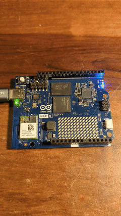
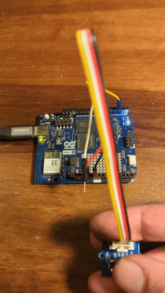
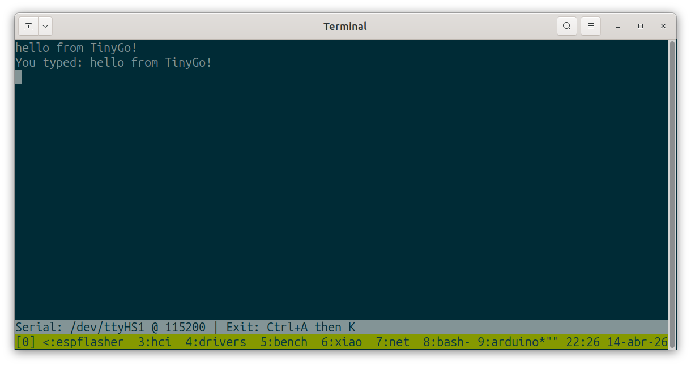
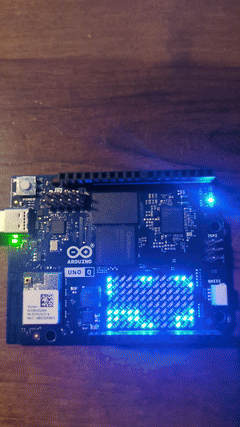
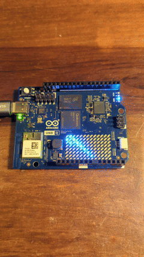
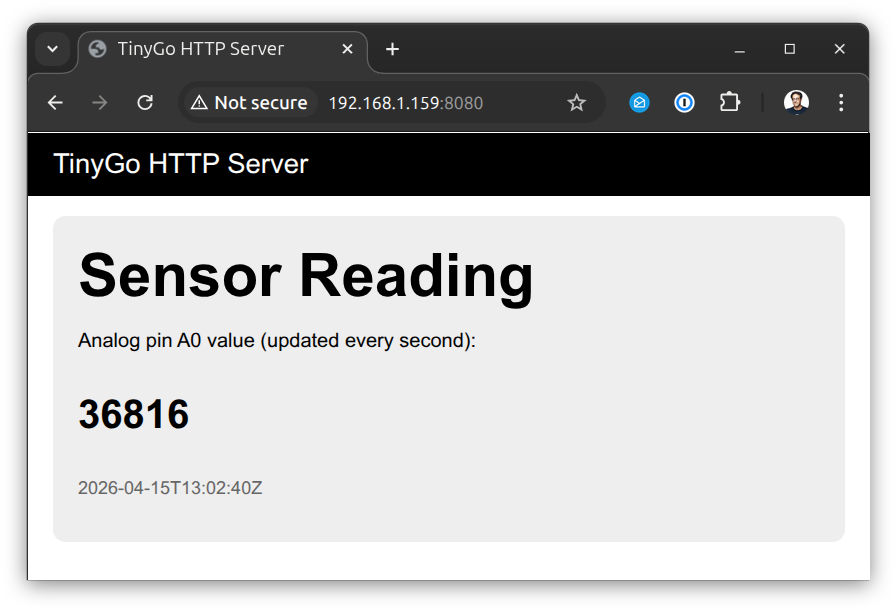

# TinyGo Arduino UNO Q Examples

[TinyGo](https://tinygo.org/) demos and examples on [Arduino UNO Q](https://docs.arduino.cc/hardware/uno-q/) board.

You must install `adb` in addition to TinyGo in order to run these examples. See the [`adb` setup info](#adb) below.

## blinky



Blinks an LED. The "Hello, World" of things.

```
$ tinygo flash -target arduino-uno-q -size short ./blinky
   code    data     bss |   flash     ram
   6004    1452    4328 |    7456    5780
/tmp/tinygo1079094009/main.hex: 1 file pushed, 0 skipped. 144.6 MB/s (20532 bytes in 0.000s)
Open On-Chip Debugger 0.12.0+dev-ge6a2c12f4 (2025-05-22-15:51)
Licensed under GNU GPL v2
For bug reports, read
        http://openocd.org/doc/doxygen/bugs.html
adapter speed: 1000 kHz
srst_only separate srst_gates_jtag srst_push_pull connect_deassert_srst
clock_config
Info : Linux GPIOD JTAG/SWD bitbang driver (libgpiod v2)
Info : Note: The adapter "linuxgpiod" doesn't support configurable speed
Info : SWD DPIDR 0x0be12477
Info : [stm32u5.ap0] Examination succeed
Info : [stm32u5.cpu] Cortex-M33 r0p4 processor detected
Info : [stm32u5.cpu] target has 8 breakpoints, 4 watchpoints
Info : [stm32u5.cpu] Examination succeed
Info : [stm32u5.ap0] gdb port disabled
Info : [stm32u5.cpu] starting gdb server on 3333
Info : Listening on port 3333 for gdb connections
CPU in Non-Secure state
[stm32u5.cpu] halted due to breakpoint, current mode: Thread 
xPSR: 0xf9000000 pc: 0x08001364 msp: 0x20001000
Error: Translation from khz to adapter speed not implemented
Error: [stm32u5.cpu] Execution of event reset-init failed:

** Programming Started **
Info : device idcode = 0x30076482 (STM32U57/U58xx - Rev U : 0x3007)
Info : TZEN = 0 : TrustZone disabled by option bytes
Info : RDP level 0 (0xAA)
Info : flash size = 2048 KiB
Info : flash mode : dual-bank
Warn : Adding extra erase range, 0x08001d20 .. 0x08001fff
** Programming Finished **
** Verify Started **
** Verified OK **
** Resetting Target **
shutdown command invoked
```

## button



Push a button, and the LED lights up.

```
$ tinygo flash -target arduino-uno-q -size short ./button
   code    data     bss |   flash     ram
   6012    1452    4328 |    7464    5780
/tmp/tinygo3279668077/main.hex: 1 file pushed, 0 skipped. 285.8 MB/s (20560 bytes in 0.000s)
Open On-Chip Debugger 0.12.0+dev-ge6a2c12f4 (2025-05-22-15:51)
Licensed under GNU GPL v2
For bug reports, read
        http://openocd.org/doc/doxygen/bugs.html
adapter speed: 1000 kHz
srst_only separate srst_gates_jtag srst_push_pull connect_deassert_srst
clock_config
Info : Linux GPIOD JTAG/SWD bitbang driver (libgpiod v2)
Info : Note: The adapter "linuxgpiod" doesn't support configurable speed
Info : SWD DPIDR 0x0be12477
Info : [stm32u5.ap0] Examination succeed
Info : [stm32u5.cpu] Cortex-M33 r0p4 processor detected
Info : [stm32u5.cpu] target has 8 breakpoints, 4 watchpoints
Info : [stm32u5.cpu] Examination succeed
Info : [stm32u5.ap0] gdb port disabled
Info : [stm32u5.cpu] starting gdb server on 3333
Info : Listening on port 3333 for gdb connections
CPU in Non-Secure state
[stm32u5.cpu] halted due to breakpoint, current mode: Thread 
xPSR: 0xf9000000 pc: 0x08001174 msp: 0x20001000
Error: Translation from khz to adapter speed not implemented
Error: [stm32u5.cpu] Execution of event reset-init failed:

** Programming Started **
Info : device idcode = 0x30076482 (STM32U57/U58xx - Rev U : 0x3007)
Info : TZEN = 0 : TrustZone disabled by option bytes
Info : RDP level 0 (0xAA)
Info : flash size = 2048 KiB
Info : flash mode : dual-bank
Info : Padding image section 0 at 0x08001d28 with 8 bytes (bank write end alignment)
Warn : Adding extra erase range, 0x08001d30 .. 0x08001fff
** Programming Finished **
** Verify Started **
** Verified OK **
** Resetting Target **
shutdown command invoked
```

## echo



Type into the console, and the Arduino UNO Q will echo back what you typed.

If you have not done it already since you have last restarted your Arduino UNO Q board, run the setup script:

macOS/Linux:

```
./tools/setup_arduino.sh
```

Windows:

```
.\tools\setup_arduino.ps1
```

Next flash the board with your TinyGo program:

```
$ tinygo flash -target arduino-uno-q -size short ./echo
   code    data     bss |   flash     ram
   6668    1484    4320 |    8152    5804
/tmp/tinygo1141501919/main.hex: 1 file pushed, 0 skipped. 181.7 MB/s (22452 bytes in 0.000s)
Open On-Chip Debugger 0.12.0+dev-ge6a2c12f4 (2025-05-22-15:51)
Licensed under GNU GPL v2
For bug reports, read
        http://openocd.org/doc/doxygen/bugs.html
adapter speed: 1000 kHz
srst_only separate srst_gates_jtag srst_push_pull connect_deassert_srst
clock_config
Info : Linux GPIOD JTAG/SWD bitbang driver (libgpiod v2)
Info : Note: The adapter "linuxgpiod" doesn't support configurable speed
Info : SWD DPIDR 0x0be12477
Info : [stm32u5.ap0] Examination succeed
Info : [stm32u5.cpu] Cortex-M33 r0p4 processor detected
Info : [stm32u5.cpu] target has 8 breakpoints, 4 watchpoints
Info : [stm32u5.cpu] Examination succeed
Info : [stm32u5.ap0] gdb port disabled
Info : [stm32u5.cpu] starting gdb server on 3333
Info : Listening on port 3333 for gdb connections
CPU in Non-Secure state
[stm32u5.cpu] halted due to breakpoint, current mode: Thread 
xPSR: 0xf9000000 pc: 0x08002f6c msp: 0x20001000
Error: Translation from khz to adapter speed not implemented
Error: [stm32u5.cpu] Execution of event reset-init failed:

** Programming Started **
Info : device idcode = 0x30076482 (STM32U57/U58xx - Rev U : 0x3007)
Info : TZEN = 0 : TrustZone disabled by option bytes
Info : RDP level 0 (0xAA)
Info : flash size = 2048 KiB
Info : flash mode : dual-bank
Info : Padding image section 0 at 0x08001fd8 with 8 bytes (bank write end alignment)
Warn : Adding extra erase range, 0x08001fe0 .. 0x08001fff
** Programming Finished **
** Verify Started **
** Verified OK **
** Resetting Target **
shutdown command invoked
```

Now connect to the board using your terminal.

macOS/Linux:

```
./tools/monitor_arduino.sh
```

Windows:

```
.\tools\monitor_arduino.ps1
```

To exit the terminal, type "CTRL-A" followed by "K". You will be prompted "Really kill this window [y/n]" then enter "y".

## life



Use the Arduino UNO Q onboard LED matrix to show playing Conway's Game of Life.

```
$ tinygo flash -target arduino-uno-q -size short ./life/
   code    data     bss |   flash     ram
   9308    1452    4352 |   10760    5804
/tmp/tinygo2703216608/main.hex: 1 file pushed, 0 skipped. 214.0 MB/s (29624 bytes in 0.000s)
Open On-Chip Debugger 0.12.0+dev-ge6a2c12f4 (2025-05-22-15:51)
Licensed under GNU GPL v2
For bug reports, read
        http://openocd.org/doc/doxygen/bugs.html
adapter speed: 1000 kHz
srst_only separate srst_gates_jtag srst_push_pull connect_deassert_srst
clock_config
Info : Linux GPIOD JTAG/SWD bitbang driver (libgpiod v2)
Info : Note: The adapter "linuxgpiod" doesn't support configurable speed
Info : SWD DPIDR 0x0be12477
Info : [stm32u5.ap0] Examination succeed
Info : [stm32u5.cpu] Cortex-M33 r0p4 processor detected
Info : [stm32u5.cpu] target has 8 breakpoints, 4 watchpoints
Info : [stm32u5.cpu] Examination succeed
Info : [stm32u5.ap0] gdb port disabled
Info : [stm32u5.cpu] starting gdb server on 3333
Info : Listening on port 3333 for gdb connections
CPU in Non-Secure state
[stm32u5.cpu] halted due to breakpoint, current mode: Thread 
xPSR: 0xf9000000 pc: 0x08001258 msp: 0x20001000
Error: Translation from khz to adapter speed not implemented
Error: [stm32u5.cpu] Execution of event reset-init failed:

** Programming Started **
Info : device idcode = 0x30076482 (STM32U57/U58xx - Rev U : 0x3007)
Info : TZEN = 0 : TrustZone disabled by option bytes
Info : RDP level 0 (0xAA)
Info : flash size = 2048 KiB
Info : flash mode : dual-bank
Info : Padding image section 0 at 0x08002a08 with 8 bytes (bank write end alignment)
Warn : Adding extra erase range, 0x08002a10 .. 0x08003fff
** Programming Finished **
** Verify Started **
** Verified OK **
** Resetting Target **
shutdown command invoked
```

## matrix



Use the Arduino UNO Q onboard LED matrix.

```
$ tinygo flash -target arduino-uno-q -size short ./matrix/
   code    data     bss |   flash     ram
  27120    3292    4344 |   30412    7636
/tmp/tinygo1428978208/main.hex: 1 file pushed, 0 skipped. 79.7 MB/s (83672 bytes in 0.001s)
Open On-Chip Debugger 0.12.0+dev-ge6a2c12f4 (2025-05-22-15:51)
Licensed under GNU GPL v2
For bug reports, read
        http://openocd.org/doc/doxygen/bugs.html
adapter speed: 1000 kHz
srst_only separate srst_gates_jtag srst_push_pull connect_deassert_srst
clock_config
Info : Linux GPIOD JTAG/SWD bitbang driver (libgpiod v2)
Info : Note: The adapter "linuxgpiod" doesn't support configurable speed
Info : SWD DPIDR 0x0be12477
Info : [stm32u5.ap0] Examination succeed
Info : [stm32u5.cpu] Cortex-M33 r0p4 processor detected
Info : [stm32u5.cpu] target has 8 breakpoints, 4 watchpoints
Info : [stm32u5.cpu] Examination succeed
Info : [stm32u5.ap0] gdb port disabled
Info : [stm32u5.cpu] starting gdb server on 3333
Info : Listening on port 3333 for gdb connections
CPU in Non-Secure state
[stm32u5.cpu] halted due to breakpoint, current mode: Thread 
xPSR: 0xf9000000 pc: 0x0800114c msp: 0x20001000
Error: Translation from khz to adapter speed not implemented
Error: [stm32u5.cpu] Execution of event reset-init failed:

** Programming Started **
Info : device idcode = 0x30076482 (STM32U57/U58xx - Rev U : 0x3007)
Info : TZEN = 0 : TrustZone disabled by option bytes
Info : RDP level 0 (0xAA)
Info : flash size = 2048 KiB
Info : flash mode : dual-bank
Warn : Adding extra erase range, 0x080076d0 .. 0x08007fff
** Programming Finished **
** Verify Started **
** Verified OK **
** Resetting Target **
shutdown command invoked
```

## mqtt

Run a TinyGo program on the Arduino UNO Q onboard microcontroller to obtain sensor readings, and run a Go program on the Arduino UNO Q Linux machine to send data using the MQTT machine to machine messaging protocol.

You must setup your Arduino UNO Q so that it has internet connection for this example to work. See https://docs.arduino.cc/tutorials/uno-q/user-manual for more info.

Connect an analog sensor such as a rotary angle sensor to the Arduino UNO Q `A0` pin for this example to send a real reading.

### Flash the microcontroller

If you have not done it already since you have last restarted your Arduino UNO Q board, run the setup script:

macOS/Linux:

```
./tools/setup_arduino.sh
```

Windows:

```
.\tools\setup_arduino.ps1
```

Now flash the "sensor" code:

```
$ tinygo flash -target arduino-uno-q -size short ./mqtt/sensor
```

### Build/deploy the Linux client

First build it:

```
mkdir -p build
GOOS=linux GOARCH=arm64 go build -o ./build/mqttclient ./mqtt/client
```

Now transfer it to the Arduino UNO Q:

```
adb push ./build/mqttclient /home/arduino/mqttclient
```

And connect to the Arduino UNO Q to run it using the `adb shell` command, and then run the `mqttclient` program:

```
$ adb shell
arduino@tinygoq:/$ cd /home/arduino/
arduino@tinygoq:~$ ./mqttclient 
2026/04/15 10:12:00 connected to MQTT broker at broker.hivemq.com:1883
2026/04/15 10:12:00 published: {"analog_a0":39200,"time":"2026-04-15T10:12:00Z"}
2026/04/15 10:12:05 published: {"analog_a0":39184,"time":"2026-04-15T10:12:05Z"}
2026/04/15 10:12:10 published: {"analog_a0":65520,"time":"2026-04-15T10:12:10Z"}
2026/04/15 10:12:15 published: {"analog_a0":64,"time":"2026-04-15T10:12:15Z"}
2026/04/15 10:12:20 published: {"analog_a0":0,"time":"2026-04-15T10:12:20Z"}
2026/04/15 10:12:25 published: {"analog_a0":25568,"time":"2026-04-15T10:12:25Z"}
```

## webserver



Run a TinyGo program on the Arduino UNO Q onboard microcontroller to obtain sensor readings, and run a Go program on the Arduino UNO Q Linux machine to serve the data over HTTP.

You must setup your Arduino UNO Q so that it has a network connection for this example to work. See https://docs.arduino.cc/tutorials/uno-q/user-manual for more info.

Connect an analog sensor such as a rotary angle sensor to the Arduino UNO Q `A0` pin for this example to send a real reading.

### Flash the microcontroller

If you have not done it already since you have last restarted your Arduino UNO Q board, run the setup script:

macOS/Linux:

```
./tools/setup_arduino.sh
```

Windows:

```
.\tools\setup_arduino.ps1
```

Now flash the "sensor" code:

```
$ tinygo flash -target arduino-uno-q -size short ./webserver/sensor
```

### Build/deploy the Linux server

First build it:

```
mkdir -p build
GOOS=linux GOARCH=arm64 go build -o ./build/webserver ./webserver/server
```

Now transfer it to the Arduino UNO Q:

```
adb push ./build/webserver /home/arduino/webserver
```

Also push the web page files:

```
adb shell mkdir -p /home/arduino/www
adb push ./webserver/server/index.html /home/arduino/www/index.html
adb push ./webserver/server/mincss.min.css /home/arduino/www/mincss.min.css
```

And connect to the Arduino UNO Q to run it using the `adb shell` command, and then run the `webserver` program:

```
$ adb shell
arduino@tinygoq:/$ cd /home/arduino/
arduino@tinygoq:~$ ./webserver
2026/04/15 10:12:00 listening on :8080
```

You can then access the sensor reading from a browser or curl at `http://<arduino-ip>:8080/sensor`:

```
$ curl http://<arduino-ip>:8080/sensor
{"analog_a0":39200,"time":"2026-04-15T10:12:00Z"}
```

You can also open `http://<arduino-ip>:8080/` in a browser to see a web page that automatically refreshes the sensor reading every second.

## Setup

### adb

adb is useful to connect the Arduino UNO Q directly to your computer without a monitor or keyboard.

You can install the `adb` command line tool for your platform here:
https://developer.android.com/tools/releases/platform-tools

#### macOS/Linux

To start a new session, plug the board into your computer using a USB-C cable, then run this command:

```
./tools/setup_arduino.sh
```

You must run that command once after plugging in your Arduino after being powered down.

Now you can use the `tinygo flash` command on your board.

If you want to see the serial output from the microcontroller, you must run the `./tools/monitor_arduino_q.sh` command.

#### Windows

To start a new session, plug the board into your computer using a USB-C cable, then run this command:

```
.\tools\setup_arduino.ps1
```

You must run that command once after plugging in your Arduino after being powered down.

Now you can use the `tinygo flash` command on your board.

If you want to see the serial output from the microcontroller, you must run the `.\tools\monitor_arduino_q.ps1` command.

### ssh

ssh is useful for when you want to connect to an Arduino UNO Q that is already on a network.

If you haven't set up SSH keys, the script will prompt you for the arduino user's password multiple times (once for every ssh and scp command). To avoid this, set up SSH keys by running ssh-copy-id arduino@<target_ip> on your local machine first.

#### macOS/Linux

```
.tools/flash_arduino_ssh.sh ./examples/unoqmatrix/ 192.168.1.159
```

#### Windows

```
.\tools\flash_arduino_ssh.ps1 .\examples\unoqmatrix\ 192.168.1.159
```
